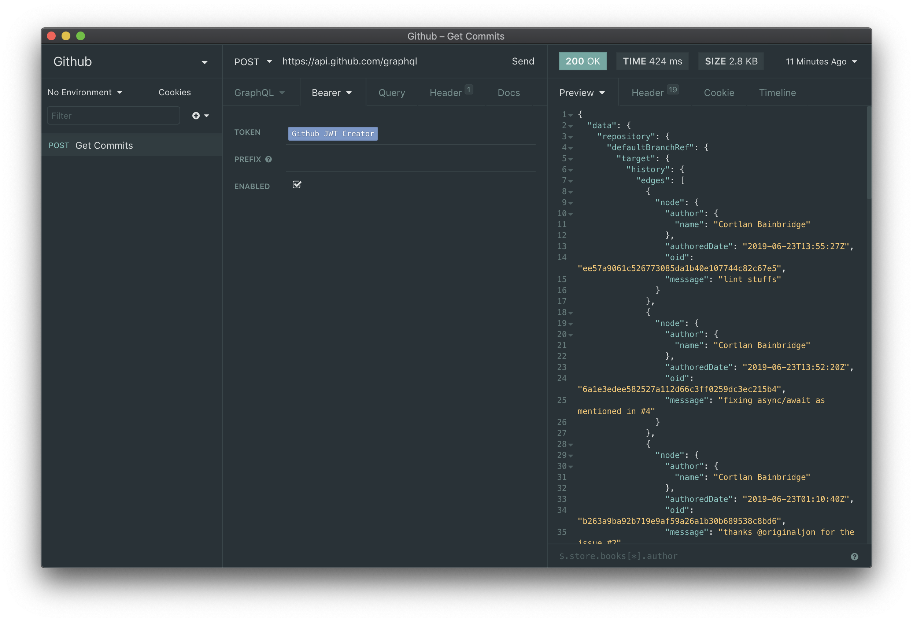
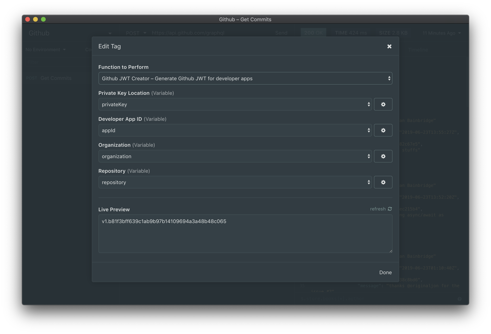

# Insomnia Plugin for Github JWT 🔌
This is a plugin for [Insomnia](https://insomnia.rest/) that creates an installation token for a specific repository for your Github Developer app.

## Installation 💾
Install the insomnia-plugin-githubjwt plugin from Preferences > Plugins

## Usage 👨‍💻
Add the Github JWT Creator template tag underneath the Authorization Bearer token spot

Then add
- The location of your Github Developer App's private key
- The Github Developer App's Id (from the URL of your edit Dev App page)
- The organization of the repo you are requesting access to
- The repository you are trying to access

That's it! 🎉